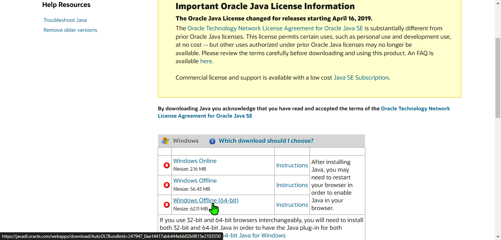
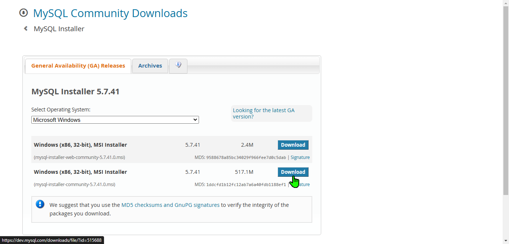
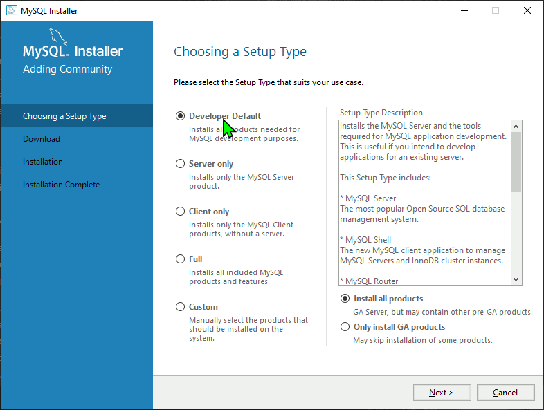

# The main objective of this application is to provide a tool for converting a relational calculus query to SQL query and execute it on a database. This application helps serve students build realtional queries and execute them to verify their corectness

## Java 8 Installation (Required to run the relcalc.jar program)

**This is the most straight forward step just Download java 8 then install and run the relcalc.jar file**

* [**Download Java_8**](https://www.java.com/en/download/manual.jsp)

* Choose the **Windows Offline (64-bit)**

  

* [**Download relcalc.jar**](https://edoras.sdsu.edu/~eckberg/downloads/relcalc.jar)

## MySQL Installation (Required to connect the database and run SQL queries from the relcalc program)

* [**Download MySQL_5.7.41**](https://dev.mysql.com/downloads/windows/installer/5.7.html)

* Download the **517M** installation file

  

* Steps To Install MySQL

  
