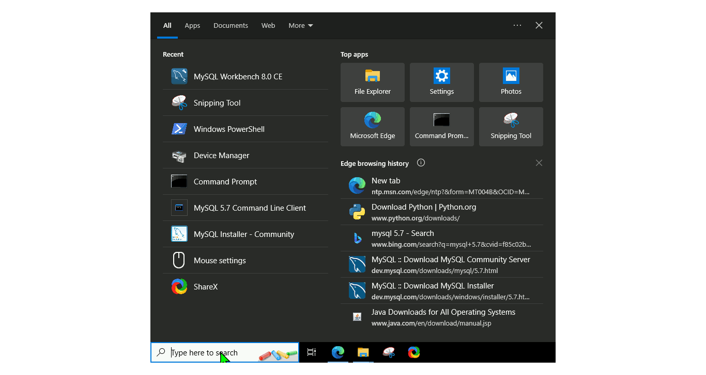
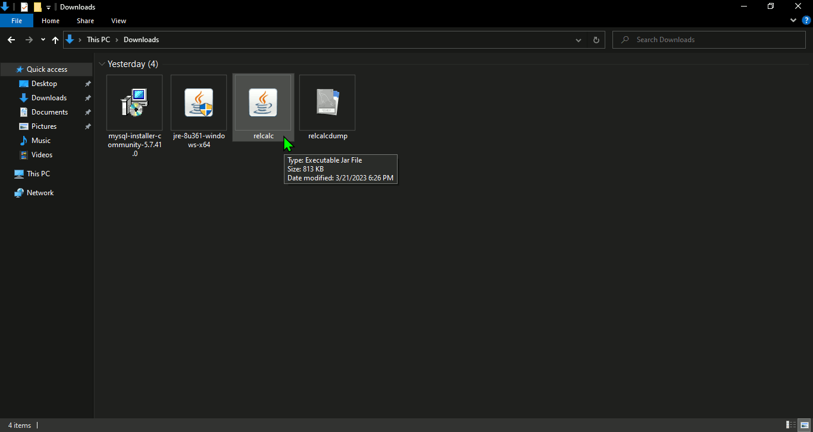

# The main objective of this guide is to help students **save their time**, When we were there, we wasted so much time searching for the right tools to use in order to run this program, so I hope this guide will help those who need it

* if you want to see the web page that we visited to get this program go to: <https://edoras.sdsu.edu/~eckberg/relationalcalculusemulator.html>

## Java 8 Installation (Required to run the relcalc.jar program)

**This is the most straight forward step just Download java 8 then install it and run the relcalc.jar file**

* [**Download relcalc.jar**](https://edoras.sdsu.edu/~eckberg/downloads/relcalc.jar)

* [**Download Java_8**](https://www.java.com/en/download/manual.jsp)

* Choose the **Windows Offline (64-bit)**

  

## MySQL Installation (Required to connect the database and run SQL queries from the relcalc program)

* [**Download MySQL_5.7.41**](https://dev.mysql.com/downloads/windows/installer/5.7.html)

* Download the **517M** installation file

  

* Steps To Install MySQL  (**password entered => root**)

  

* Steps to Create a database (**password entered => root**)

* [**Download this file relcalcdump.sql**](https://edoras.sdsu.edu/~eckberg/downloads/relcalcdump.sql)

  

## relcalc usage

  
